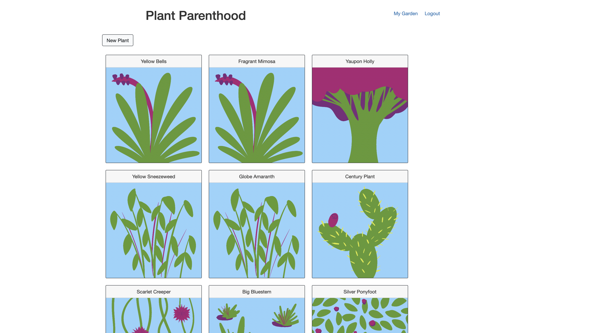
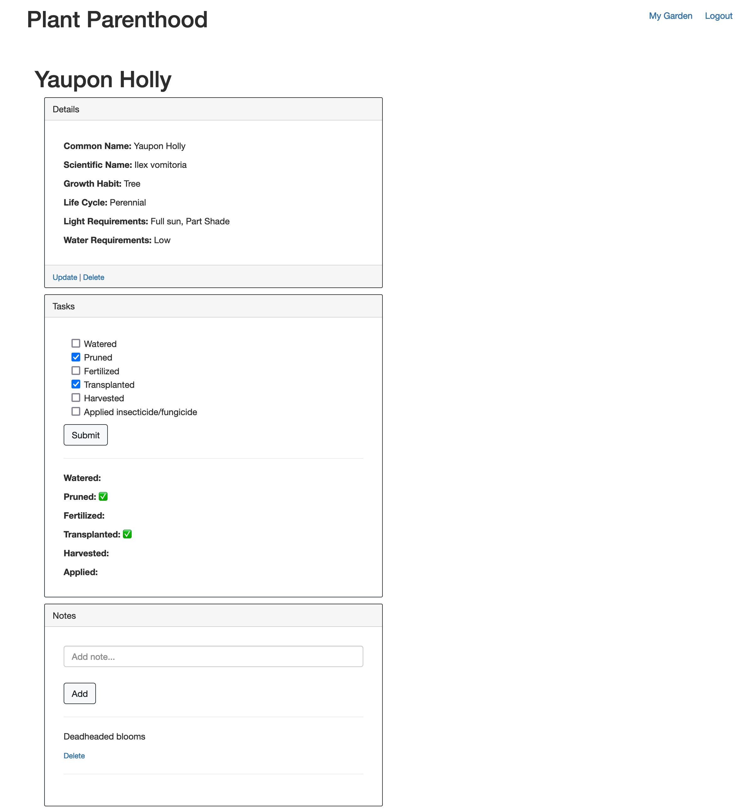

# Plant Parenthood

## Description
An app that allows gardeners to manage their plants, their garden tasks, and to record observations.

<<<<<<< HEAD
[LIVE APP - Heroku](https://obscure-mountain-85382.herokuapp.com/)  
  
## Table of Contents
- [Screenshots](#screenshots)
=======
[Deployed App](https://plant-parenthood.herokuapp.com/)  
  
## Table of Contents
- [Screenshots](#screenshots)
- [Usage](#usage)
>>>>>>> 545e823a7f4e2a308396d46c0a9c79dd291b9e72
- [Contributing](#contributing)
- [License](#license)
  
## Screenshots

<<<<<<< HEAD
=======
## Usage
Create a username and password or log in with username: happygardener and password: password to display an existing garden. You will be brought to the garden dashboard. Click "New Plant" and add the characteristics of the desired plant. After the plant is created, click on its image. From there, click "Update" or "Delete" to perform those actions, select checkboxes under the Tasks section, or add a note in the Notes section.

>>>>>>> 545e823a7f4e2a308396d46c0a9c79dd291b9e72
 
## Contributing
[Emre Taskale](https://github.com/EM-T-Shells), [Alex Berger](https://github.com/aberger3647), [Heather Korczynski](https://github.com/hkorczynski), [Jonathan Vera](https://github.com/JTVera)

  
## License
Learn more about [MIT](https://choosealicense.com/licenses/mit/).
